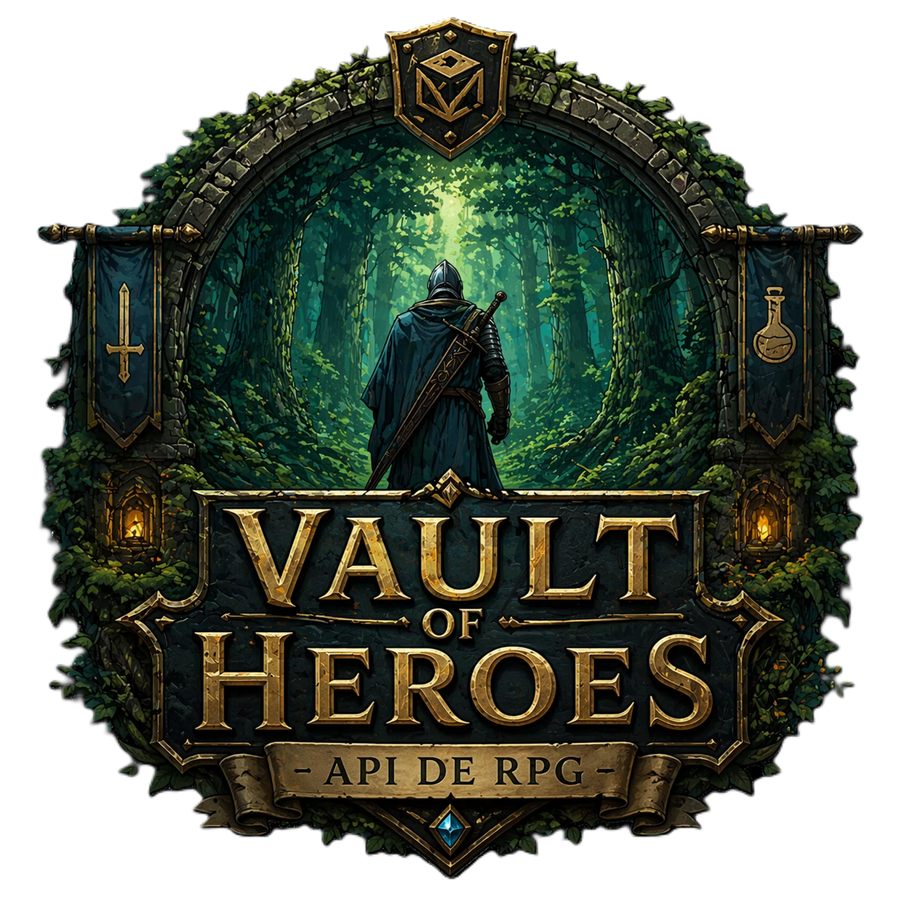

# 🛡️ Vault of Heroes - API de RPG



<p align="left">API REST para gerenciamento de heróis, itens e guildas em um cenário de RPG. O projeto evolui de um modelo inicial monolítico para uma <b>arquitetura modular (MVC)</b>, com separação clara de responsabilidades e foco em manutenção, escalabilidade e legibilidade.</p>

> **Objetivo:** repositório de estudo com foco em práticas de back-end.

---

## 🚀 Stack

- **Node.js** + **Express**
- **SQLite3**
- **Async/Await**
- **Middleware Pattern**

---

## 🧱 Arquitetura

Estrutura baseada em MVC, com responsabilidades bem definidas:

- **Routes**  
  Mapeamento de endpoints e definição das rotas da API.

- **Controllers**  
  Implementação da lógica de negócio, regras do domínio (RPG) e orquestração de acesso ao banco.

- **Middlewares**  
  Camadas transversais: validação, logging e proteção de entrada.

- **Database**  
  Configuração e acesso centralizado ao SQLite.

- **Organização de Projetos**  
  Organização do projeto em pastas para cada camada.

```Markdown
📂src
┣ 📂controllers
┣ 📂database
┣ 📂middlewares
┣ 📂repositories
┣ 📂routes
┣ 📂schemas
┣ 📂services
┗ 📂utils
```
---


## ⚙️ Funcionalidades


### ⚔️ Itens e Heróis
- Listagem de itens disponíveis.
- Consulta de herói por ID.
- Validação de parâmetros na URL.

### 🛒 Sistema de Vendas (Transacional)
- Verifica existência de herói e item.
- Valida saldo de ouro do herói.
- Registra a venda no banco.
- **Atualização em cascata:** ajusta o prestígio da guilda após compra concluída.

### 🛡️ Middlewares
- **Logger:** registra método HTTP, rota e timestamp.
- **Validação de ID:** garante que apenas IDs numéricos sejam processados.

---

## ▶️ Execução

1. **Clone o repositório**
```bash
git clone <LINK_REPOSITORIO>
cd <NOME_DO_PROJETO>
```

2. **Instale as depedências**
```bash
npm install
```

3. **Inicie a aplicação**
```bash
npm start
```
---

## 🗄️ Banco de Dados
O projeto utiliza SQLite com um banco já populado em: `src/database/VaultOfHeroes.db`. 
<br>Dados Iniciais:
- 10 Guildas
- 25 Heróis
- 30 Itens

---

## 📌 Observações
- Projeto voltado para prática de organização de código e padrões de arquitetura.
- Foco em clareza de fluxo (request → middleware → controller → database).
- Pode ser estendido com:
    - Camada de services (para desacoplar regras de negócio dos controllers)
    - Validação com schema (ex: Zod/Joi)
    - Documentação com Swagger
    - Testes automatizados (Jest/Supertest)